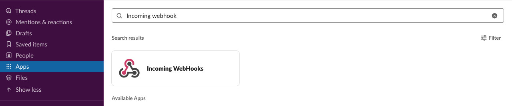

# SLACK
## はじめに
  グループチャットアプリケーションSlack（スラック）に対して通知を送る機能を利用する事が可能です。

## 事前準備
### 「Incoming WebHooks」アプリの有効化
  SLACKに対してメッセージを送信する前に、事前に[「Incoming WebHooks」](https://slack.com/apps/A0F7XDUAZ-incoming-webhooks)
アプリを有効化する必要があります。

#### アプリの有効化
  SLACKの画面から、以下の手順通りに実施する事で、「Incoming WebHooks」アプリの有効化が可能です。

> **Incoming WebHooks の有効化**
> 

- Slackアプリから、「Apps」をクリック
- 検索ボックスに、「Incoming WebHooks」と入力
- 「View in App Directory」をクリック
- ブラウザが開いたページで「Add to Slack」ボタンをクリック

#### 通知先のURLを取得する
  「Incoming WebHooks」アプリの有効化後にリダイレクトされるWebページで、
通知先のURLを確認する事が可能です。

> **通知先のURL確認**
> 

## SLACKにメッセージを送信する
  SLACKにメッセージを送信する際には、環境変数として渡す方法、オプションとして渡す方法があります。

```bash tab="環境変数からURLを設定する"
export SLACK_WEBHOOK_URL=[SLACK 通知用URL]
noct slack [CHANNEL] [TITLE] [USERNAME] [ICON_EMOJI]
```

```bash tab="コマンド引数からURLを設定する"
noct slack [CHANNEL] [TITLE] [USERNAME] [ICON_EMOJI] --url [SLACK 通知用URL]
```

### コマンド引数
  SLACKにメッセージを送信した際には以下のようにSLACK側に通知メッセージが送信されます。

> **SLACKへ通知メッセージの見え方**
> 

|    | コマンド引数 | 説明                                |
|----|--------------|-------------------------------------|
|    | CHANNEL      | 送信するSLACKのチャネル名           |
| ①  | TITLE        | タイトル名                          |
| ②  | USERNAME     | SLACK通知の表示名を変更します       |
| ③  | ICON_EMOJI   | SLACK通知の表示アイコンを変更します |

#### アイコンを変更する
  SLACKを使用して、通知を行う際にアイコンを変更する事が可能です。複数の用途の異なる通知を行う際には、
アイコンを変更する事で容易に、何を目的とした通知であるかを、確認する事が可能です。
  以下にアイコン変更の際に必要な、表示コードの例を示します。

| 絵文字 | 表示コード       |
|--------|------------------|
| 😀     | \:grinning\:     |
| 😁     | \:grin\:         |
| 😂     | \:joy\:          |

### オプション
#### URL付きボタンを送信する
```bash tab="引数"
noct slack [チャネル名] --buttons "メッセージ:ボタンを入力した際に遷移するURL" --url [SLACK 通知用URL]
```

```bash tab="実行コマンドサンプル"
noct slack [チャネル名] --buttons "メッセージ:https://example.com/" --url [SLACK 通知用URL]
```

> **URL付きのボタンを送信**  
> 

